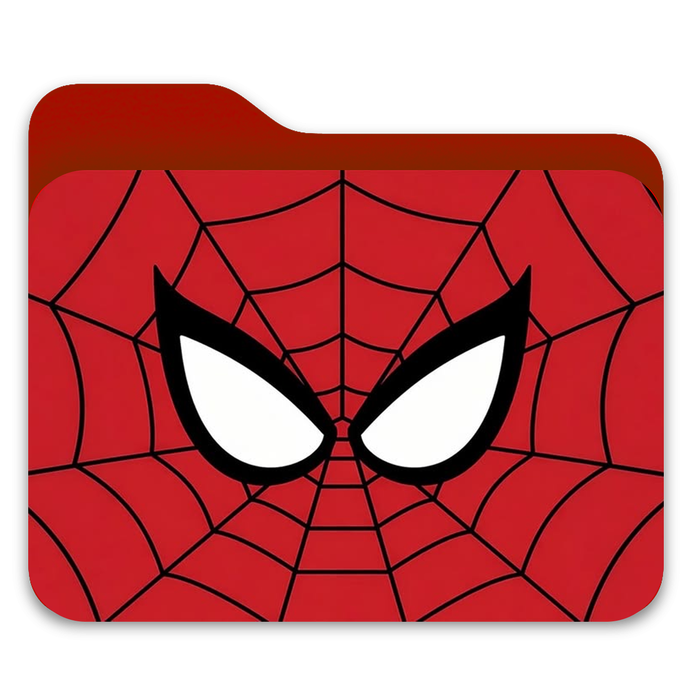

  

<table width="100%">
  <tr>
    <td width="33.33%" valign="top" align="center">
       
      <strong>Education</strong>  
      <small>
        <strong>University of Seoul</strong> 
        Computer Science 
        Formerly Business Administration
      </small>
        
      
    </td>
    <td width="33.33%" valign="top" align="center">
       
      <strong>Location</strong>  
      <small><strong>Daegu 😍 · Seoul</strong></small>
        
      
      
      
    </td>
    <td width="33.34%" valign="top" align="center">
       
      <strong>Tech Stack</strong>  
      📚 🌱 🤫 🍀 ⌨️ ✏️
        
      
      
      
      
      
      
      
      
    </td>
  </tr>
</table>
